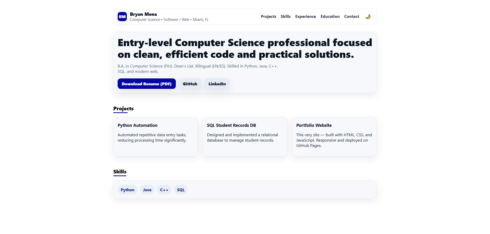

# Bryan Mena — Portfolio Website

This repository contains the source code for my personal portfolio, built with **HTML, CSS, and JavaScript** and deployed with **GitHub Pages**.

🔗 **Live Site:** [https://bryxnn.github.io](https://bryxnn.github.io)  
📄 **Resume PDF:** [Download here](resume.pdf)  

---

## 🚀 Features
- Responsive design (works on desktop & mobile)
- Dark/light mode toggle
- Smooth scrolling navigation
- Sections for Projects, Skills, Experience, and Education

---

## 🛠️ Technologies Used
- **HTML5**
- **CSS3** (custom, with modern layout and design)
- **JavaScript** (dark mode, smooth scrolling, dynamic year)

---

## 📥 Run Locally
```bash
# Clone the repo
git clone https://github.com/bryxnn/bryxnn.github.io.git

# Open index.html in your browser
```

---

## 📸 Preview


---

## 📬 Contact
- Email: [menabryan35@gmail.com](mailto:menabryan35@gmail.com)  
- LinkedIn: [linkedin.com/in/bryan-mena-66a36129b](https://www.linkedin.com/in/bryan-mena-66a36129b/)  
- GitHub: [github.com/bryxnn](https://github.com/bryxnn)  
